<div align="center">

# 🌍 Traversal

### Reisebuchungs-Plattform mit ASP.NET Core MVC

Mehrschichtige Webanwendung mit öffentlicher Website, Admin-Panel und Kundenbereich –
entwickelt von **Amir Reza Afshar** im Rahmen der Umschulung zum Fachinformatiker für Anwendungsentwicklung.

[](https://traversalcoreproject.onrender.com)
[](https://traversalcoreproject.onrender.com/Demo/Admin)
[](https://traversalcoreproject.onrender.com/Demo/Member)


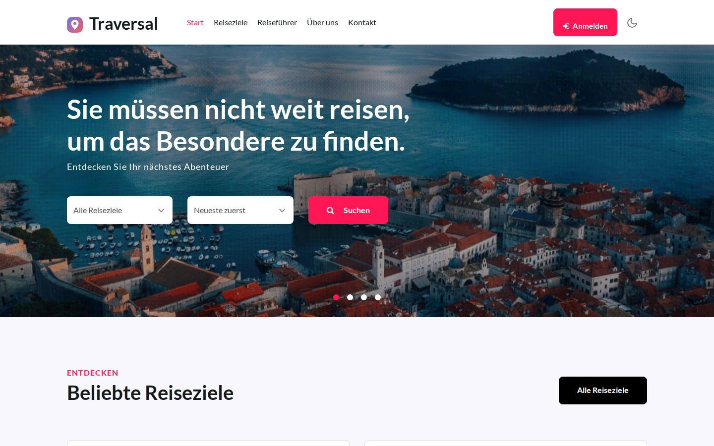

</div>

---

## 📑 Inhalt

- [Live-Demo](#-live-demo)
- [Über das Projekt](#-über-das-projekt)
- [Funktionen](#-funktionen)
- [Architektur](#️-architektur)
- [Technologien](#-technologien)
- [Screenshots](#️-screenshots)
- [Lokal starten](#-lokal-starten)
- [Deployment](#️-deployment)
- [Sicherheit & Datenschutz](#-sicherheit--datenschutz)
- [Entwickler](#-entwickler)

---

## 🚀 Live-Demo

Die Anwendung läuft online – **ohne Registrierung** mit einem Klick testbar:

| | Link | Beschreibung |
|---|---|---|
| 🌐 **Website** | [traversalcoreproject.onrender.com](https://traversalcoreproject.onrender.com) | Öffentliche Reise-Website |
| 🛠️ **Admin-Panel** | [/Demo/Admin](https://traversalcoreproject.onrender.com/Demo/Admin) | Direkt als Administrator angemeldet |
| 🧳 **Kundenbereich** | [/Demo/Member](https://traversalcoreproject.onrender.com/Demo/Member) | Direkt als Kunde angemeldet |

> ℹ️ Alle Änderungen sind erlaubt – die Demo-Datenbank wird automatisch zurückgesetzt.
> Gehostet im kostenlosen Render-Plan: Nach längerer Inaktivität kann der erste Aufruf ca. 30–60 Sekunden dauern.

---

## 💡 Über das Projekt

**Traversal** ist ein fiktiver Reiseveranstalter. Ausgangspunkt war ein rein statisches HTML-Template – daraus habe ich eine
vollständige, datenbankgestützte Anwendung mit sauberer **N-Tier-Architektur** entwickelt:

- Kunden entdecken Reiseziele, schreiben Bewertungen und reservieren Reisen online.
- Das Team verwaltet im Admin-Panel Reiseziele, Reservierungen, Kommentare, Reiseführer, Benutzer, Rollen und Website-Inhalte.
- Die Datenbank (SQLite) liegt direkt im Projekt – keine Installation nötig.

---

## ✨ Funktionen

<table>
<tr>
<td width="33%" valign="top">

### 🌐 Website
- Startseite mit Schnellsuche
- Reiseziele mit Suche & Sortierung
- Detailseiten mit Galerie
- Bewertungen per AJAX
- Über uns, Reiseführer, Kontakt
- Newsletter-Anmeldung
- Registrierung & Login
- Hell-/Dunkel-Modus

</td>
<td width="33%" valign="top">

### 🛠️ Admin-Panel
- Dashboard mit KPIs & Diagrammen
- Reiseziele (CRUD, Bild-Upload)
- Reservierungen bestätigen/stornieren
- Kommentare moderieren
- Reiseführer verwalten
- Benutzer & Rollen
- Seiteninhalte bearbeiten
- Nachrichten & Newsletter (CSV)

</td>
<td width="33%" valign="top">

### 🧳 Kundenbereich
- Übersicht mit Reise-Countdown
- Reservierung in 2 Schritten
- Live-Preisberechnung
- Reservierungen ändern/stornieren
- Eigene Kommentare verwalten
- Profil & Passwort ändern

</td>
</tr>
</table>

**Rollen:** `Admin` (voller Zugriff) · `Moderator` (Kommentare & Dashboard) · `Member` (Kundenbereich)

---

## 🏗️ Architektur

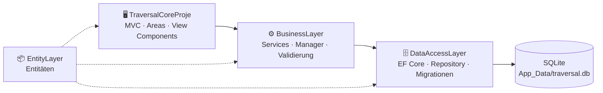

```
TraversalCoreProject/
├── EntityLayer/          Entitäten (Destiniton, Reservition, Comment, Guide, User, Roll …)
├── DataAccessLayer/      Context, Migrationen, GenericRepository, Ef…DAL-Klassen
├── BusinessLayer/        I…Service-Interfaces, Manager, FluentValidation, DI-Registrierung
├── TraversalCoreProje/   Controller, Areas (Admin, Member), Views, View Components, wwwroot
│   └── App_Data/         SQLite-Datenbank + Seed-Daten (JSON)
├── docs/screenshots/     Screenshots für dieses README
├── Dockerfile            Container-Build für das Deployment
└── render.yaml           Render-Blueprint
```

**Eingesetzte Muster & Konzepte**

| Konzept | Umsetzung |
|---|---|
| N-Tier-Architektur | Strikte Trennung in Entity-, DataAccess-, Business- und Präsentationsschicht |
| Repository-Pattern | `GenericRepository<T>` + spezialisierte `Ef…DAL`-Klassen |
| Service-Schicht | `GenericManager<T>` + spezialisierte Manager mit Geschäftslogik |
| Dependency Injection | Zentrale Registrierung in `BusinessLayer/Container`, `DbContext` pro Request |
| Code First | EF-Core-Migrationen, automatische Migration beim Start |
| Authentifizierung | ASP.NET Core Identity mit Rollen und deutschen Fehlermeldungen |
| Validierung | FluentValidation + Data Annotations |

---

## 🧩 Technologien

| Bereich | Technologien |
|---|---|
| Backend | C#, ASP.NET Core MVC (.NET 8), Entity Framework Core, ASP.NET Core Identity |
| Datenbank | SQLite (Code First, Migrationen, Seed-Daten) |
| Frontend | Razor Views, HTML5, CSS3, JavaScript, jQuery, Bootstrap 4, ApexCharts |
| Bibliotheken | FluentValidation, X.PagedList |
| DevOps | Docker, Render (Region Frankfurt), Git & GitHub |

---

## 🖼️ Screenshots

### 🌐 Website
| Startseite | Reiseziele |
|---|---|
|  | 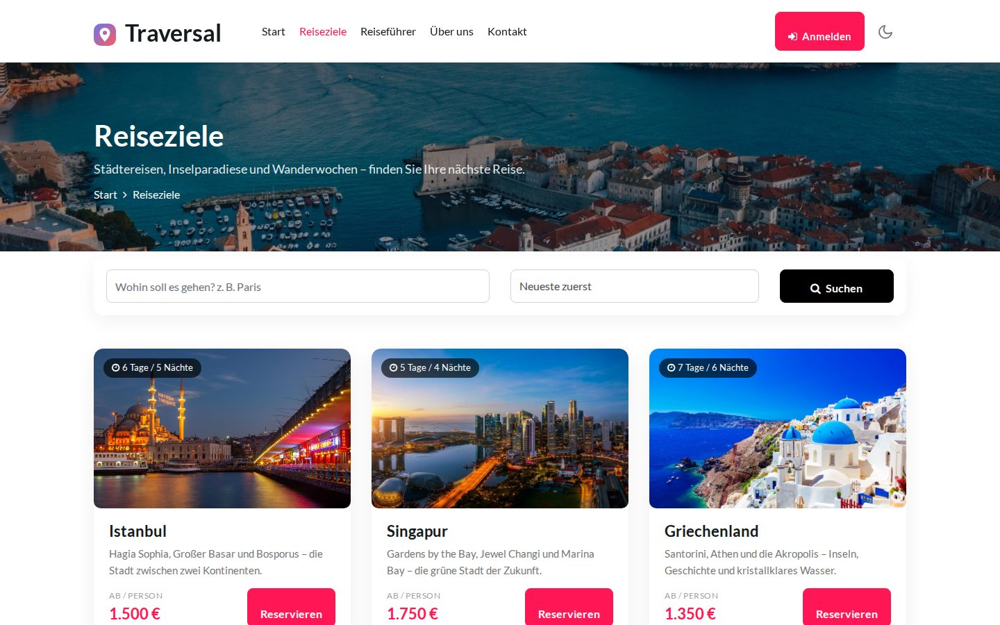 |

| Reiseziel-Detailseite | Anmeldung mit Demo-Zugang |
|---|---|
| 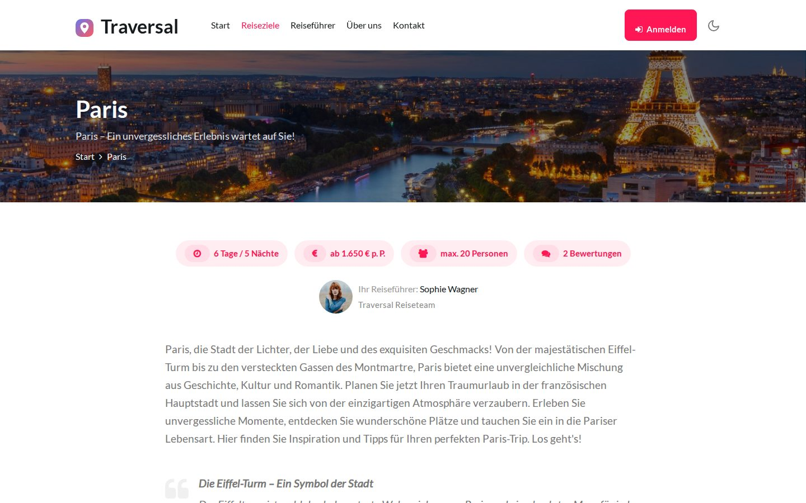 | 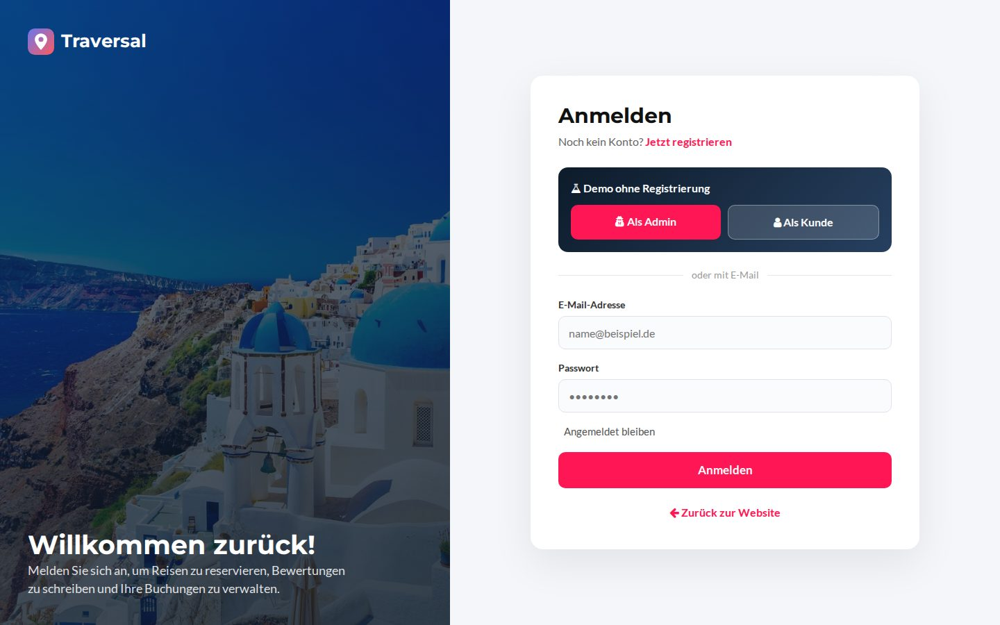 |

### 🛠️ Admin-Panel
| Dashboard | Reservierungen |
|---|---|
| 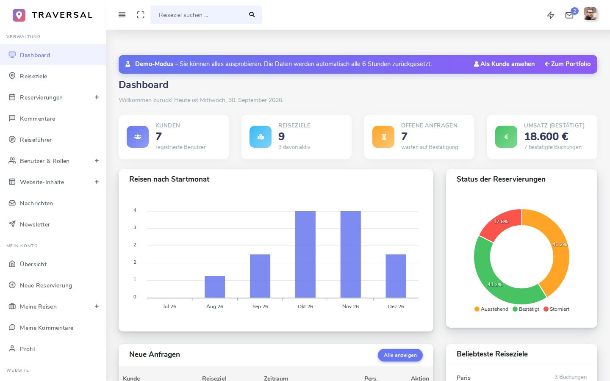 | 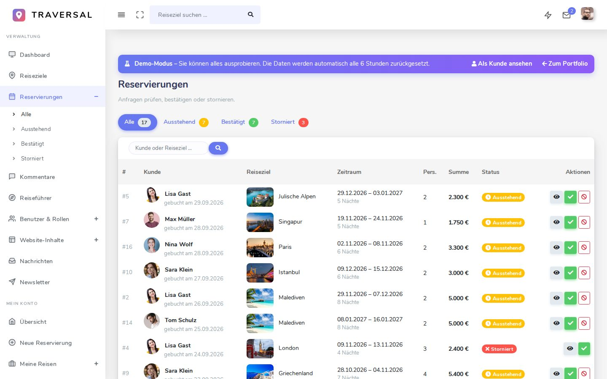 |

| Reiseziele | Reiseziel bearbeiten |
|---|---|
| 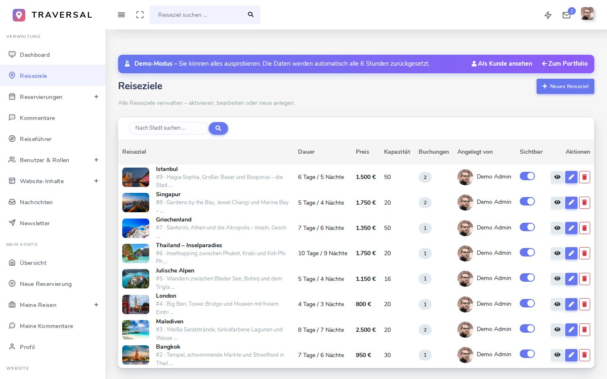 | 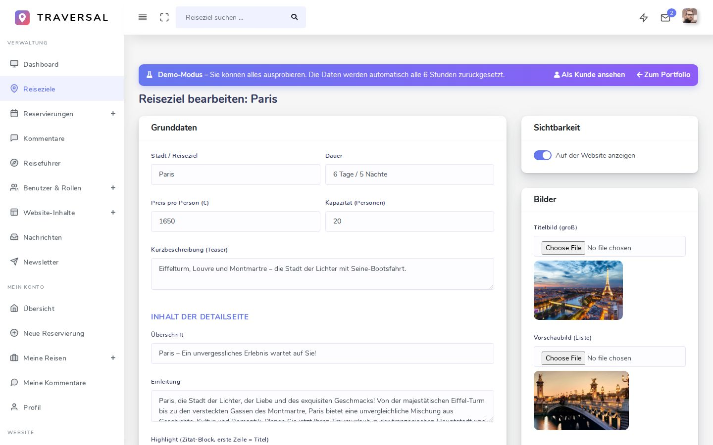 |

| Kommentare | Benutzer & Rollen |
|---|---|
| 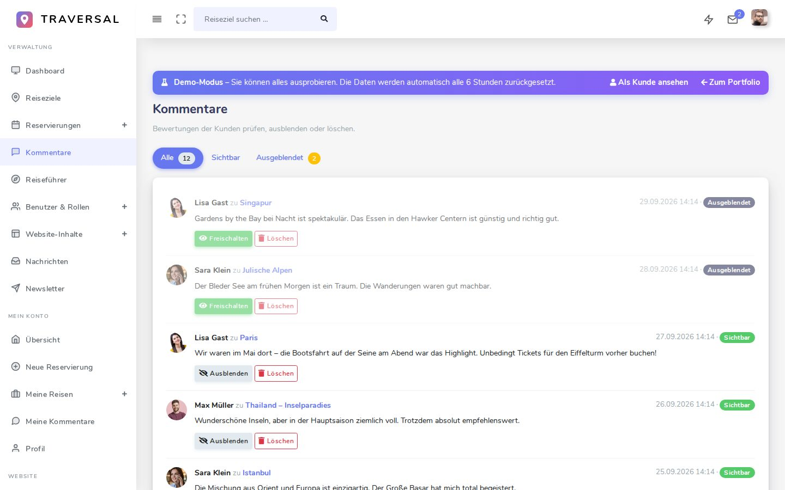 | 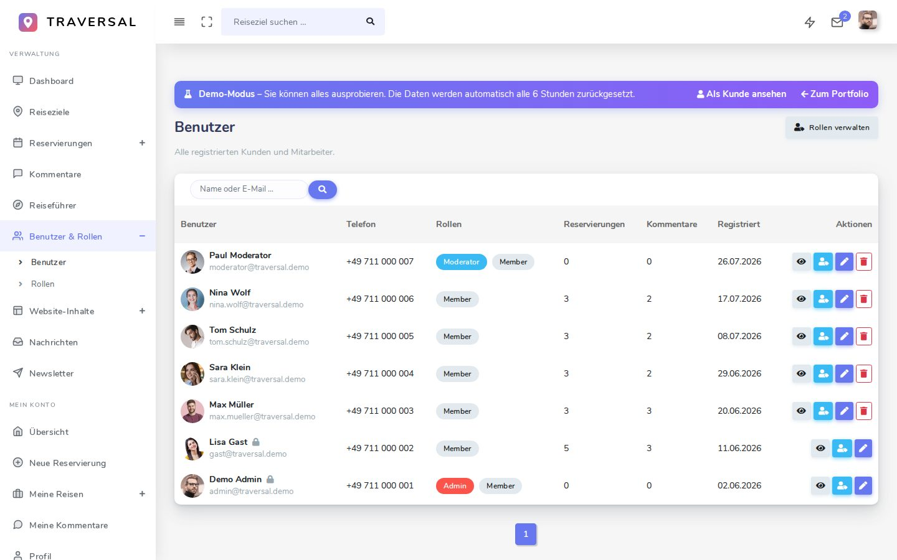 |

### 🧳 Kundenbereich
| Übersicht | Neue Reservierung | Meine Reisen |
|---|---|---|
| 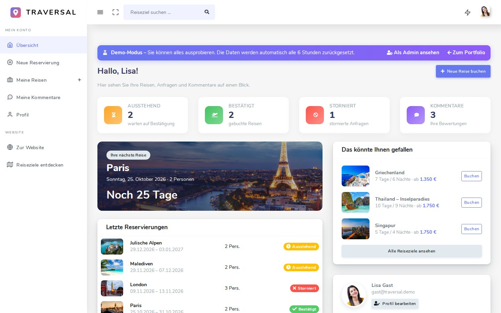 | 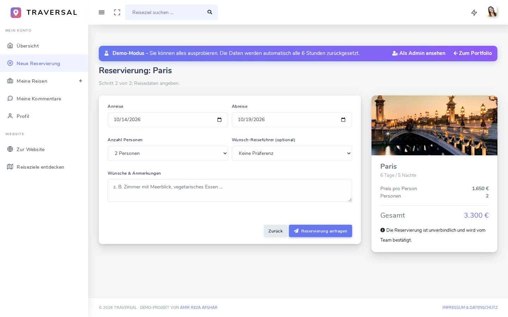 | 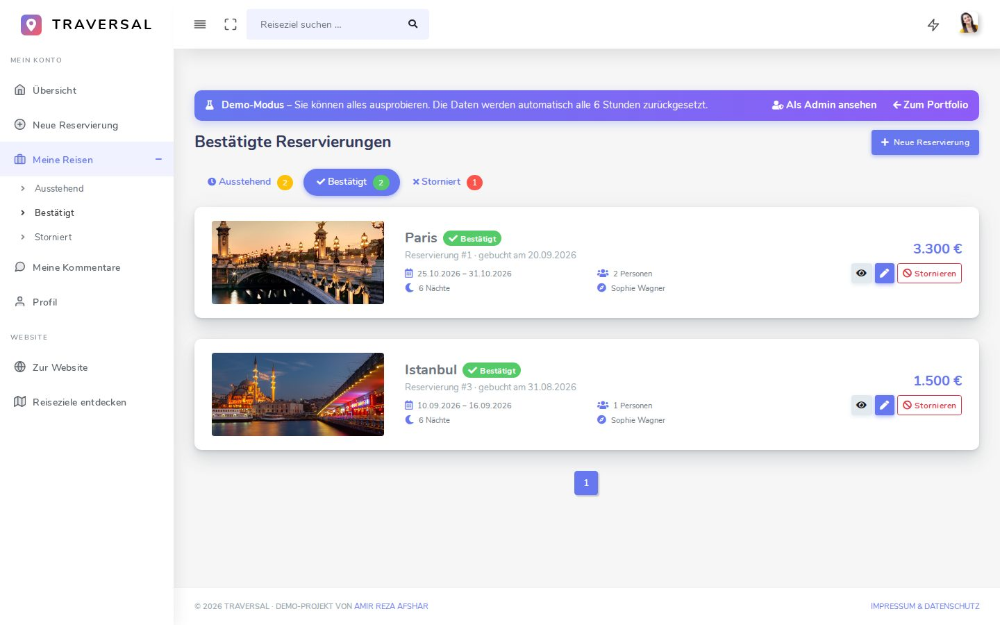 |

---

## 💻 Lokal starten

**Voraussetzung:** [.NET 8 SDK](https://dotnet.microsoft.com/download/dotnet/8.0)

```bash
git clone https://github.com/amirafshar2/TraversalCoreProject.git
cd TraversalCoreProject/TraversalCoreProje
dotnet run
```

Danach im Browser die angezeigte Adresse öffnen (z. B. `http://localhost:5031`).

| Konto | E-Mail | Passwort |
|---|---|---|
| Admin | `admin@traversal.demo` | `Demo123!` |
| Kunde | `gast@traversal.demo` | `Demo123!` |

- Fehlende Migrationen werden beim Start automatisch angewendet; eine leere Datenbank wird mit Demo-Daten aus `App_Data/seed/seed-data.json` befüllt.
- Einstellungen in `appsettings.json` → Abschnitt `Demo` (Demo-Modus, Reset-Intervall, Links).

<details>
<summary><b>Neue Migration anlegen</b></summary>

```bash
dotnet ef migrations add <Name> --project DataAccessLayer --startup-project TraversalCoreProje
```
</details>

<details>
<summary><b>KI-Reiseassistent aktivieren (optional, Google Gemini)</b></summary>

Der API-Schlüssel wird nie im Code gespeichert:

```bash
dotnet user-secrets set "Gemini:ApiKey" "<Ihr-Schlüssel>" --project TraversalCoreProje
```
</details>

---

## ☁️ Deployment

Die Live-Version läuft als **Docker-Container auf Render** (Region Frankfurt, EU).

1. Repository bei [Render](https://render.com) als *Web Service* (Docker) oder *Blueprint* (`render.yaml`) verbinden
2. Branch `master`, Root Directory leer, Instance Type *Free*
3. Optional: Umgebungsvariable `Gemini__ApiKey` setzen

Bei jedem Start und danach regelmäßig wird die Demo-Datenbank auf den Ausgangszustand zurückgesetzt.

---

## 🔒 Sicherheit & Datenschutz

- ✅ Anti-Forgery-Token für alle Formulare und AJAX-Anfragen
- ✅ Rollenbasierte Autorisierung – Kunden sehen und ändern nur ihre eigenen Reservierungen
- ✅ Upload-Prüfung: nur Bilddateien bis 5 MB
- ✅ Keine Geheimnisse im Quellcode (API-Schlüssel über User-Secrets / Umgebungsvariablen)
- ✅ DSGVO-freundlich: Schriften und Skripte werden lokal ausgeliefert, kein Tracking

---

## 👤 Entwickler

**Amir Reza Afshar** – Umschulung zum Fachinformatiker für Anwendungsentwicklung

[](https://amirrezaafshar.de)
[](https://github.com/amirafshar2)

<sub>Design-Vorlagen: „Traversal“ von W3Layouts und „Otika“ Admin-Template. Alle Personen und Daten in der Demo sind fiktiv.</sub>
