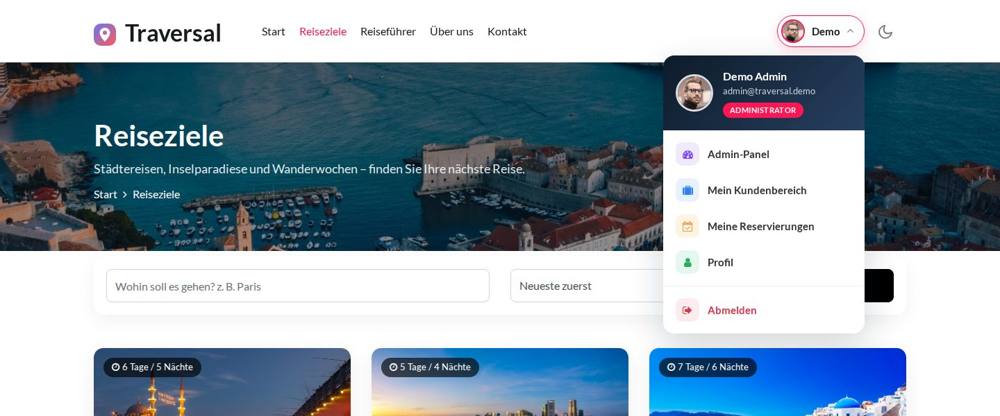

# 🌍 Traversal – Reisebuchungs-Plattform mit ASP.NET Core

Traversal ist ein Reiseverwaltungs- und Buchungssystem auf Basis von **ASP.NET Core MVC (.NET 8)**.
Ausgangspunkt war ein rein statisches HTML-Template – daraus habe ich eine vollständige, **mehrschichtige Webanwendung** mit Datenbank, Geschäftslogik, Admin-Panel, Kundenbereich und Reservierungssystem entwickelt.

> 🎯 **Live-Demo ohne Registrierung**
> - **Admin-Panel:** `/Demo/Admin`
> - **Kundenbereich:** `/Demo/Member`
> - Übersicht: `/Demo`
>
> Alle Änderungen sind erlaubt – die Demo-Datenbank wird automatisch alle 6 Stunden zurückgesetzt.

---

## ✨ Funktionen

### 🌐 Öffentliche Website
- Startseite mit Schnellsuche, beliebten Reisezielen, Kennzahlen, Top-Angeboten, Reiseführern und Kundenstimmen
- Reiseziel-Liste mit Suche und Sortierung, Detailseite mit Bildern, Fakten und ähnlichen Reisezielen
- Bewertungen (Kommentare) per AJAX – nur für angemeldete Benutzer
- Seiten „Über uns“, „Reiseführer“ und „Kontakt“ (Kontaktformular mit Validierung)
- Newsletter-Anmeldung, Impressum-/Datenschutz-Hinweise, eigene 404-/403-Seiten
- Registrierung und Anmeldung (ASP.NET Core Identity)

### 🛠️ Admin-Panel (Rollen: Admin, teilweise Moderator)
- **Dashboard** mit Kennzahlen, Umsatz und Diagrammen (ApexCharts)
- **Reiseziele:** anlegen, bearbeiten, löschen, Sichtbarkeit per Schalter (AJAX), Bild-Upload mit Vorschau
- **Reservierungen:** filtern (ausstehend / bestätigt / storniert), bestätigen, stornieren, Reiseführer zuweisen
- **Kommentare:** freischalten, ausblenden, löschen (auch für Moderatoren)
- **Reiseführer:** CRUD mit FluentValidation
- **Benutzer & Rollen:** Benutzer bearbeiten/löschen, Rollen anlegen und zuweisen
- **Website-Inhalte:** „Über uns“, Startseiten-Banner, Vorteile, Kontaktdaten, Top-Angebote, Kundenstimmen
- **Nachrichten** aus dem Kontaktformular und **Newsletter** (CSV-Export)

### 🧳 Kundenbereich
- Übersicht mit Countdown zur nächsten Reise und Empfehlungen
- Neue Reservierung in zwei Schritten mit Live-Preisberechnung
- Eigene Reservierungen bearbeiten oder stornieren (mit Besitzprüfung)
- Eigene Kommentare verwalten, Profil und Passwort ändern

---

## 🏗️ Architektur

```
TraversalCoreProje.sln
├── EntityLayer          → Entitäten (Destiniton, Reservition, Comment, Guide, User, Roll, …)
├── DataAccessLayer      → EF Core Context, Migrationen, GenericRepository, Ef…DAL-Klassen
├── BusinessLayer        → Services (I…Service) & Manager, FluentValidation, DI-Registrierung
└── TraversalCoreProje   → ASP.NET Core MVC: Controller, Areas (Admin, Member), View Components
```

- **N-Tier-Architektur** mit klarer Trennung von Daten, Logik und Präsentation
- **Repository-Pattern** (`GenericRepository<T>`) und **generische Manager** (`GenericManager<T>`)
- **Dependency Injection** – ein `Context` pro Request (Scoped)
- **Areas** für Admin- und Kundenbereich, **View Components** für wiederverwendbare Bausteine
- **ASP.NET Core Identity** mit Rollen (Admin, Moderator, Member)

---

## 🧩 Technologien
- C#, ASP.NET Core MVC (.NET 8)
- Entity Framework Core (Code First, Migrationen)
- **SQLite** – die Datenbank liegt direkt im Projekt
- ASP.NET Core Identity, FluentValidation, X.PagedList
- HTML, CSS, JavaScript, jQuery, Bootstrap 4, ApexCharts
- Docker, Render

---

## 🚀 Lokal starten

```bash
git clone https://github.com/amirafshar2/TraversalCoreProject.git
cd TraversalCoreProject/TraversalCoreProje
dotnet run
```

- **Keine Datenbank-Installation nötig:** Die SQLite-Datenbank liegt unter `TraversalCoreProje/App_Data/traversal.db`.
- Beim Start werden fehlende Migrationen automatisch angewendet. Ist die Datenbank leer, werden Beispieldaten aus `App_Data/seed/seed-data.json` eingespielt.
- **Demo-Konten:** `admin@traversal.demo` (Admin) und `gast@traversal.demo` (Kunde), Passwort `Demo123!`
- Einstellungen in `appsettings.json` → Abschnitt `Demo` (Demo-Modus, Reset-Intervall, Portfolio- und Impressum-Links)

### Neue Migration anlegen
```bash
dotnet ef migrations add <Name> --project DataAccessLayer --startup-project TraversalCoreProje
```

### KI-Reiseassistent (optional)
Der Assistent nutzt Google Gemini. Der API-Schlüssel wird **nicht** im Code gespeichert:
```bash
dotnet user-secrets set "Gemini:ApiKey" "<Ihr-Schlüssel>" --project TraversalCoreProje
```

---

## ☁️ Deployment (Render, kostenlos)
`Dockerfile` und `render.yaml` sind enthalten:
1. Repository bei [Render](https://render.com) als **Blueprint** verbinden
2. Region *Frankfurt*, Plan *Free*
3. Optional die Umgebungsvariable `Gemini__ApiKey` setzen

Im Container wird die Demo-Datenbank bei jedem Start und danach alle 6 Stunden zurückgesetzt.

---

## 🔒 Sicherheit & Datenschutz
- Anti-Forgery-Token für alle Formulare und AJAX-Anfragen
- Upload-Prüfung: nur Bilddateien bis 5 MB
- Rollenbasierte Autorisierung; Kunden können nur ihre eigenen Reservierungen ändern
- Schriften und Skripte werden lokal ausgeliefert – keine Verbindung zu Google Fonts oder CDNs (DSGVO)
- Keine Geheimnisse im Quellcode

---

## 🖼️ Screenshots

### 🌐 Website
| Startseite | Reiseziele |
|---|---|
|  |  |

| Reiseziel-Detailseite | Anmeldung mit Demo-Zugang |
|---|---|
|  |  |



### 🛠️ Admin-Panel
| Dashboard | Reservierungen |
|---|---|
|  |  |

| Reiseziele | Reiseziel bearbeiten |
|---|---|
|  |  |

| Kommentare | Benutzer & Rollen |
|---|---|
|  |  |

### 🧳 Kundenbereich
| Übersicht | Neue Reservierung | Meine Reisen |
|---|---|---|
|  |  |  |

---

## 👤 Entwickler
**Amir Reza Afshar** – Umschulung zum Fachinformatiker für Anwendungsentwicklung
GitHub: https://github.com/amirafshar2 · Portfolio: https://amirrezaafshar.de
